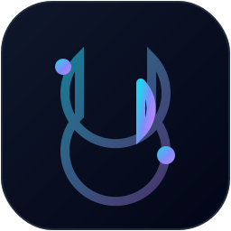

<div align="center">



# Glyra

**Build smaller, faster, and more secure desktop applications with Go.**

[](https://ecocee.in)
[](https://go.dev/)
[](LICENSE)

<p>
  <a href="#-quick-start"><b>Quick Start</b></a> ·
  <a href="#-features"><b>Features</b></a> ·
  <a href="#-the-go--js-bridge"><b>Go ↔ JS Bridge</b></a> ·
  <a href="#-cli-reference"><b>CLI Reference</b></a> ·
  <a href="#-documentation"><b>Docs</b></a>
</p>

</div>

<br />

**Glyra** is a desktop application framework by the [Ecocee Team](https://ecocee.in). It lets you build cross-platform desktop apps with web technologies on the frontend and Go on the backend — no Node.js runtime to ship, no Chromium bundle to carry. Just the OS's native webview, a single Go binary, and your frontend embedded inside it.

<br />

## ✨ Why Glyra?

<table>
<tr>
<th align="left">Feature</th>
<th align="center">Glyra</th>
<th align="center">Electron</th>
<th align="center">Tauri</th>
</tr>
<tr>
<td>Backend Language</td>
<td align="center"><b>Go</b></td>
<td align="center">Node.js</td>
<td align="center">Rust</td>
</tr>
<tr>
<td>Binary Size</td>
<td align="center"><b>~5 MB</b></td>
<td align="center">~150 MB</td>
<td align="center">~10 MB</td>
</tr>
<tr>
<td>Memory Usage</td>
<td align="center"><b>~20 MB</b></td>
<td align="center">~200+ MB</td>
<td align="center">~30 MB</td>
</tr>
<tr>
<td>Boot Time</td>
<td align="center"><b>&lt; 0.1s</b></td>
<td align="center">~2.5s</td>
<td align="center">&lt; 0.5s</td>
</tr>
<tr>
<td>Frontend</td>
<td align="center">React, Next.js, Svelte, plain HTML</td>
<td align="center">Any</td>
<td align="center">Any</td>
</tr>
</table>

<br />

## 🧩 Features

- 🚀 **Native desktop apps with Go** — the performance of Go with modern web interfaces
- 🎨 **Multiple frontend templates** — React (TS/JS), Next.js, Svelte, and vanilla HTML/CSS, scaffolded in seconds
- 🔥 **Flutter-like hot reloading** — frontend edits trigger HMR through Vite/Next; editing `.go` files automatically recompiles and relaunches the backend. Press `r` + `Enter` to reload manually
- 🔌 **Go ↔ JS bridge** — bind a Go function once, call it from JavaScript as `await window.MyFunction()`. No HTTP, no WebSockets, no CORS
- 🧱 **Component generator** — drop shadcn/ui-style components into your project with `glyra add <name>`
- 📦 **Native OS packaging** — automatic macOS `.app` bundles, Windows `.syso` resources, and Linux `.desktop` entries on build

<br />

## ⚡ Quick Start

### 1. Install the CLI

```bash
go install github.com/ecocee/golang-ui/cmd/glyra@latest
```

### 2. Scaffold a project

```bash
glyra init my-app
```

You'll be prompted to choose a frontend template:

| # | Template | Stack |
|:-:|:---------|:------|
| 1 | **Vite + React (TypeScript)** · *Recommended* | React + Vite + TS |
| 2 | Vite + React (JavaScript) | React + Vite |
| 3 | Next.js (Static Export) | Next.js |
| 4 | Vanilla HTML / CSS / JS | No framework |

Glyra generates the project, wires up the Go module, and runs `npm install` automatically.

### 3. Develop

```bash
cd my-app
glyra dev
```

For the React and Next.js templates this starts the Vite/Next dev server **and** the Go backend together. Frontend edits hot-reload instantly; `.go` edits trigger a backend recompile and relaunch. The vanilla template runs the Go backend directly — no bundler required.

### 4. Ship a production binary

```bash
glyra build
```

Glyra builds your frontend into static assets, then compiles a single Go binary with the UI embedded via `//go:embed`. The result is one file — copy it anywhere, no `frontend/` directory required.

<br />

## 🎨 Adding UI Components

Drop pre-built, shadcn/ui-style components into your React or Next.js project:

```bash
glyra add button
glyra add card
glyra add input
glyra add checkbox
glyra add table
glyra add dialog
```

Components are written to `frontend/src/components/ui/` and can be composed or customized freely.

<br />

## 🔌 The Go ↔ JS Bridge

Binding a Go function exposes it globally on the `window` object. The call is always async and returns a Promise.

**Backend (Go)**

```go
w.Bind("GetSystemStatus", func() string {
    return "running"
})
```

**Frontend (JavaScript / TypeScript)**

```typescript
const status = await window.GetSystemStatus();
console.log(status); // "running"
```

For larger applications, register whole services at once with `api.Register("Auth", &AuthService{})` — every exported method becomes available as `window.Auth_<Method>()`. See the [API reference](docs/api.md) for details.

Because the frontend runs inside a native webview, bindings are available directly on `window` without HTTP, WebSockets, or CORS overhead.

<br />

## 📁 Project Structure

A scaffolded project keeps the framework wiring and your logic in separate places:

```
my-app/
├── go.mod
├── go.sum
├── main.go                  # thin entrypoint — wires the window, registers services
├── src/
│   └── system.go            # your backend logic — add more files here as you scale
└── frontend/                # your web UI (template-specific)
    ├── package.json
    ├── vite.config.js
    ├── index.html
    └── src/
        ├── main.jsx
        ├── App.jsx
        ├── App.css
        └── index.css
```

`main.go` is intentionally thin — it only wires the webview window and registers your
backend services. You rarely edit it. All your logic lives under `src/` as service
structs: register each in `main.go` and every exported method becomes callable from the
frontend as `window.<Service>_<Method>()`. Your project scales by adding files to `src/`,
not by growing a single entrypoint.

<br />

## 🖥️ CLI Reference

| Command | Description |
|:--------|:-------------|
| `glyra init <name>` | Scaffold a new project |
| `glyra dev` | Run backend + frontend with hot reload |
| `glyra build` | Compile an optimized, standalone binary |
| `glyra add <component>` | Add a UI component to the frontend |
| `glyra version` | Print the CLI version |
| `glyra help` | Show available commands |

<br />

## 📚 Documentation

- 📖 [Getting Started](docs/getting-started.md) — full walkthrough from install to production
- 🔌 [API Reference](docs/api.md) — the Go ↔ JavaScript bridge in depth
- 🎨 [Templates & Icons](docs/templates-and-icons.md) — customizing app icons and native packaging

<br />

<details>
<summary><b>🗂️ Repository Layout</b> (for contributors)</summary>

<br />

```
cmd/glyra/                        CLI entrypoint
internal/cli/                     command implementations (init, dev, build, add, …)
internal/scaffold/                templating engine
internal/scaffold/templates/      vanilla · react · react-ts · nextjs · svelte
pkg/api/                          Go ↔ WebView IPC bridge
pkg/dialog/                       native OS dialog helpers
pkg/tray/                         native system tray support
pkg/license/                      hardware-locked licensing utilities
```

Starter templates live as real files under `internal/scaffold/templates/`, embedded into the CLI binary at compile time with `//go:embed`. Files ending in `.tmpl` are rendered through `text/template` (so they can use `{{.ProjectName}}` and `{{.PackageName}}`); everything else is copied byte-for-byte. Adding a new template is just adding a new folder — no Go string literals to edit.

</details>

<br />

## 🤝 Contributing

Issues and pull requests are welcome. If you're proposing a new frontend template or a sizable feature, please open an issue first so we can talk through the approach.

<br />

---

<div align="center">
  <sub>Built with ❤️ by the <a href="https://ecocee.in">Ecocee Team</a> · MIT License</sub>
</div>